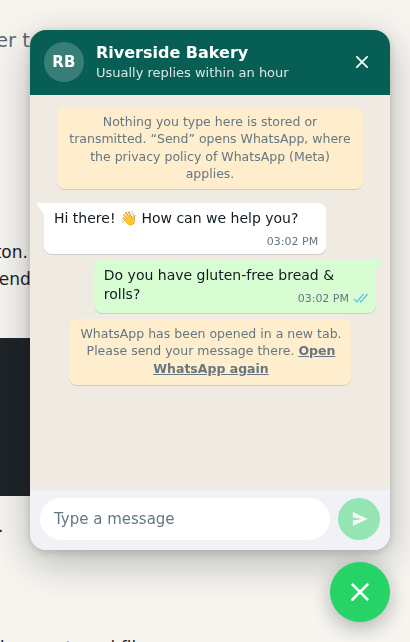

# WhatsApp Widget

A privacy-friendly WhatsApp chat widget for any website. It looks like a live chat,
but it only opens WhatsApp (app or WhatsApp Web) with the visitor's message already filled in.

- **One `<script>` tag.** No build step, no dependencies, no framework.
- **Privacy by design.** No backend, no cookies, no tracking, no external requests.
  Nothing leaves the browser until the visitor presses “Send”.
- **Open it your way.** Floating button, auto-open after a few seconds, or your own buttons and links.
- **Accessible.** Keyboard support, screen reader labels, respects “reduced motion”.
- **Themeable.** Light, dark or automatic theme, your own colours, English and German texts.
- **Optional e-mail notification.** Get every message by e-mail, so no request gets lost: via the
  [hosted service](#hosted-service) (nothing to install) or a [PHP script on your own server](#own-php-script).

> **Status:** v2 is in development. The API may still change. See the
> [examples](https://whatsapp-widget.doebeling.dev/examples/01-minimal.html).



## Quick start

Add this before `</body>` and replace the phone number with yours:

```html
<script src="https://whatsapp-widget.doebeling.dev/whatsapp-widget.js"
        data-phone="+49 911 1234567"
        data-name="Your Company"
        data-welcome="Hi there! 👋 How can we help you?"
        defer></script>
```

That's it. Only `data-phone` is required. Use the international format with country code
(`+49 911 1234567`, not `0911 1234567`).

Even easier: the **[configurator](https://whatsapp-widget.doebeling.dev)** lets you fill in a form,
shows a live preview and gives you the code to copy.

For the strictest privacy setup, [host the file yourself](#privacy-and-gdpr).

## Examples

| Example | Shows |
| --- | --- |
| [1 · Minimal](https://whatsapp-widget.doebeling.dev/examples/01-minimal.html) ([source](examples/01-minimal.html)) | One script tag with a floating button |
| [2 · Own buttons](https://whatsapp-widget.doebeling.dev/examples/02-external-button.html) ([source](examples/02-external-button.html)) | No floating button, opened from links and buttons with prefilled messages |
| [3 · JavaScript API](https://whatsapp-widget.doebeling.dev/examples/03-javascript-api.html) ([source](examples/03-javascript-api.html)) | Configuration in JavaScript, German texts, 3 welcome messages, auto-open, events |
| [4 · PHP add-on](https://whatsapp-widget.doebeling.dev/examples/04-php-addon.html) ([source](examples/04-php-addon.html)) | Optional e-mail notification with the visitor's phone number |

## Configuration

Use `data-*` attributes on the script tag, or pass the same options (in camelCase) to
`WhatsAppWidget.init()`.

| Attribute | JS option | Default | Description |
| --- | --- | --- | --- |
| `data-phone` | `phone` | – | **Required.** Your WhatsApp number in international format. |
| `data-name` | `name` | `WhatsApp` | Name in the chat header. |
| `data-status` | `status` | – | Text below the name, e.g. `Usually replies within a day`. |
| `data-avatar` | `avatar` | initials | URL of a profile picture. Host it yourself. |
| `data-welcome` | `welcome` | – | Up to 3 welcome messages. Separate them with `\|` in the attribute, or pass an array. |
| `data-placeholder` | `placeholder` | localised | Placeholder text of the input field. |
| `data-lang` | `lang` | `<html lang>` | `en` or `de`. Falls back to the browser language, then English. |
| `data-position` | `position` | `right` | `right` or `left`. |
| `data-launcher` | `launcher` | `true` | `false` hides the floating button. Use your own buttons instead. |
| `data-badge` | `badge` | `true` | Shows the number of welcome messages on the button until the chat is opened. |
| `data-auto-open` | `autoOpen` | `false` | Seconds until the chat opens by itself. Skipped on small screens. |
| `data-typing` | `typing` | `true` | Shows “typing…” before each welcome message. |
| `data-target` | `target` | `auto` | `auto` opens `wa.me`, `web` opens WhatsApp Web, `app` opens the installed app (`whatsapp://`). |
| `data-theme` | `theme` | `light` | `light`, `dark` or `auto` (follows the operating system). |
| `data-color` | `color` | WhatsApp green | Colour of header, button and send button, e.g. `#8a4b20`. |
| `data-privacy-url` | `privacyUrl` | – | Link to your privacy policy, shown in the privacy notice. |
| `data-privacy-notice` | `privacyNotice` | localised | Your own privacy notice. An empty value hides it. |
| `data-site-key` | `siteKey` | – | Your key for the [hosted e-mail notification](#hosted-service), from the configurator. |
| `data-notify-url` | `notifyUrl` | – | URL of your [own PHP script](#own-php-script). “Send” posts the message there. |
| `data-ask-phone` | `askPhone` | `required` with notification | Asks for the visitor's phone number: `required`, `optional` or `false`. Only works with an e-mail notification. |

Example with JavaScript:

```html
<script src="https://whatsapp-widget.doebeling.dev/whatsapp-widget.js"></script>
<script>
  WhatsAppWidget.init({
    phone: '+49 911 1234567',
    name: 'Max Mustermann',
    welcome: ['Hello! 👋', 'How can we help you?'],
    lang: 'de',
    autoOpen: 5,
  });
</script>
```

## Open the chat with your own buttons

Add `data-wa-open` to any link or button. The value is optional and becomes the prefilled message.

```html
<!-- Works without JavaScript, too: the link goes straight to WhatsApp -->
<a href="https://wa.me/499111234567" data-wa-open>Chat with us</a>

<button data-wa-open="Hi, is the olive tree in stock?">Ask about this product</button>
```

Use `data-launcher="false"` if you don't want the floating button at all.

## JavaScript API

```js
WhatsAppWidget.init(options);                     // create the widget (replaces an existing one)
WhatsAppWidget.open();                            // open the chat
WhatsAppWidget.open({ message: 'Hello' });        // open with a prefilled message
WhatsAppWidget.close();
WhatsAppWidget.toggle();
WhatsAppWidget.destroy();                         // remove the widget
WhatsAppWidget.buildUrl('+49 911 1234567', 'Hi'); // "https://wa.me/499111234567?text=Hi"
```

## Events

The widget does not track anything. If you want to count usage with your own (privacy-friendly)
analytics, listen to these events on `document`:

| Event | `event.detail` | Notes |
| --- | --- | --- |
| `whatsapp-widget:open` | `{ auto }` | `auto` is `true` if the chat opened by itself. |
| `whatsapp-widget:close` | `{}` | |
| `whatsapp-widget:send` | `{ message, url, phone }` | Call `event.preventDefault()` to stop WhatsApp from opening. |
| `whatsapp-widget:notify` | `{ ok, status }` | Only with e-mail notification: `ok` is `true` if the server answered `204`. |

## Optional: e-mail notification

Some visitors write a message but never press “Send” in WhatsApp, for example because WhatsApp Web
is not set up on their computer. With an e-mail notification, you still get the message:

- “Send” transmits message and phone number to the notification server and opens WhatsApp at the
  same time. The chat confirms when the message has reached you.
- The chat asks for the visitor's phone number (required by default), so you can call back.
  Use `data-ask-phone="optional"` or `"false"` to change this.
- The privacy notice in the chat changes automatically (see [Privacy and GDPR](#privacy-and-gdpr)).
  Set `data-privacy-url` and mention the notification in your privacy policy.

You get an e-mail like this:

```text
New message via the WhatsApp widget on www.example.com

Hello, we need a new logo for our bakery.

---
Phone: 0176 123 456 78
Reply on WhatsApp: https://wa.me/4917612345678
Page: https://www.example.com/services
Time: 2026-09-25 17:52:20 CEST
```

### Hosted service

Nothing to install. In the [configurator](https://whatsapp-widget.doebeling.dev), choose
“E-mail via this service”, enter your e-mail address and your website, and accept the data processing
agreement. You get a confirmation link by e-mail. After the confirmation, the configurator shows your
code with a `data-site-key`, and you get the code by e-mail, too:

```html
<script src="https://whatsapp-widget.doebeling.dev/whatsapp-widget.js"
        data-phone="+49 911 1234567"
        data-privacy-url="/privacy"
        data-site-key="wwk1_…"
        defer></script>
```

The service is built so that it can't be misused as an open mail relay:

- **No free choice of recipient.** Mails only go to addresses that confirmed a link (double opt-in).
  The site key contains your address and domains, encrypted with a server secret. It is public in your
  HTML, but reveals nothing. The server stores no e-mail addresses.
- **Only your website.** The server accepts messages only from pages on the domains in your key
  (and their `www` variant).
- **Proof of work.** While the visitor types, the widget solves a small puzzle (about one second of
  computing, no request, no cookie). Each solution works only once. This makes mass sending expensive.
- **Limits** per site key, per visitor (IP address as keyed hash with a daily changing input, kept for
  one hour) and in total.
- **Visitor input only in the mail body**, never in mail headers. No `Reply-To` from the request.
- **Stop at any time.** Every notification contains a link that switches off the notifications of your key.

The service passes messages on by e-mail and stores no message content. It works as processor for you
(Art. 28 GDPR), under the data processing agreement you accept in the configurator.

### Own PHP script

Don't want a third party in between? Use [`addons/php/whatsapp-notify.php`](addons/php/whatsapp-notify.php)
on your own web server (PHP 8.1+):

1. Download the file, set your e-mail address at the top and upload it.
2. Point the widget to it with `data-notify-url="/whatsapp-notify.php"` instead of `data-site-key`.

The script sends mails only to the address in the file, accepts only `POST` requests from your own
website, checks the proof of work, limits message length and mails per hour, and stores nothing.
If you write your own endpoint: it gets `message`, `phone`, `page` and `pow` as form fields and must
answer `204 No Content`.

## Styling

The widget uses Shadow DOM, so your page styles don't break it and its styles don't leak into your page.
To change colours, set CSS custom properties on the `whatsapp-widget` element:

```css
whatsapp-widget {
  --waw-color: #8a4b20;          /* header, button, send button */
  --waw-launcher-color: #25d366; /* floating button and send button only */
  --waw-font: "Inter", sans-serif;
  --waw-offset: 24px;            /* distance from the screen edge */
  --waw-z-index: 1000;
}
```

More properties: `--waw-header-text`, `--waw-chat-bg`, `--waw-panel-bg`, `--waw-input-bg`, `--waw-bubble-in`,
`--waw-bubble-out`, `--waw-notice-bg`, `--waw-text`, `--waw-muted`.

## Privacy and GDPR

The widget is built for data minimisation. The notice at the top of the chat says what happens:

| Setup | Notice (English / German) |
| --- | --- |
| Widget only | Nothing is transmitted before you click “Send”. After that, your message and contact details go to WhatsApp (Meta). <br> *Vor dem Klick auf „Senden“ wird nichts übertragen. Danach gehen Nachricht und Kontaktdaten an WhatsApp (Meta).* |
| With e-mail notification | Nothing is transmitted before you click “Send”. After that, your message and phone number go to us by e-mail, and your message and contact details go to WhatsApp (Meta). <br> *Vor dem Klick auf „Senden“ wird nichts übertragen. Danach gehen Nachricht und Telefonnummer per E-Mail an uns sowie Nachricht und Kontaktdaten an WhatsApp (Meta).* |

The German texts avoid “du” and “Sie”, so they fit any website. Use `privacyNotice` for your own text.

In detail:

1. **Before “Send”:** The widget runs only in the browser. It sends no requests, sets no cookies and
   uses no local storage. Icons are inline SVG, fonts are system fonts.
2. **After “Send”:** The browser opens `wa.me`, WhatsApp Web or the WhatsApp app. From this moment on,
   WhatsApp (Meta) processes the data under its own privacy policy. The widget shows a notice about this.
3. **Only with e-mail notification:** “Send” also transmits message, phone number and page address to
   your own server or to the hosted service, which e-mails them to you. The notice in the chat says so.

**Hosting.** `whatsapp-widget.doebeling.dev` runs on a server in Germany. If you load
`whatsapp-widget.js` from there, the visitor's browser connects to that server and transmits the IP
address, like with any externally hosted script or font. For the strictest setup, download
[`whatsapp-widget.js`](whatsapp-widget.js), upload it to your own server and change the `src`.
Host the avatar image yourself, too. The hosted e-mail notification works with a self-hosted script as well.

Mention WhatsApp as a contact channel in your privacy policy. This is not legal advice.

## Browser support

All current versions of Chrome, Edge, Firefox and Safari (desktop and mobile).
The widget uses modern JavaScript (ES2018) and does not support Internet Explorer.

## Running the site and the notification service

The repository is the complete website of `whatsapp-widget.doebeling.dev`: configurator (`index.html`),
examples, widget and the notification service in [`api/`](api). To run it on your own web server:

1. Upload the files to the web root. You need PHP 8.1+ with the `sodium` extension and a working `mail()`.
2. Copy [`api/config.sample.php`](api/config.sample.php) to `whatsapp-widget-config.php` in the directory
   **above** the web root and fill it in. Create the secret with
   `php -r "echo base64_encode(random_bytes(32)), PHP_EOL;"`.
3. Create the storage directory from the configuration (outside the web root, writable for PHP).
4. Set up SPF, DKIM and DMARC for the sender address, and provide the data processing agreement (`dpa_url`).

[`api/.htaccess`](api/.htaccess) blocks direct access to `lib.php` and a local `config.php` on Apache.

## Contributing

Issues and pull requests are welcome. The widget is a single file without build step:
[`whatsapp-widget.js`](whatsapp-widget.js). To try your changes, start PHP's built-in server in the
repository (`php -S 127.0.0.1:8080`) and open the configurator or the examples.

## License

[GPL-3.0](LICENSE) © [DÖBELING Projektbüro](https://doebeling.de)

WhatsApp is a trademark of WhatsApp LLC. This project is not affiliated with or endorsed by WhatsApp or Meta.
The WhatsApp icon is from [Font Awesome Free](https://fontawesome.com) ([CC BY 4.0](https://fontawesome.com/license/free)).
